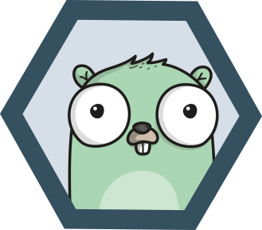

# HexaGo - Hexagonal Architecture Scaffolding CLI



[](https://go.dev/)
[](LICENSE)

HexaGo is an opinionated CLI tool to scaffold for Go applications following the **Hexagonal Architecture** (Ports & Adapters) pattern. It helps developers maintain proper separation of concerns and build maintainable applications.

## Features

### ✨ Project Generation (Phase 1)
- 🚀 **One Command Setup** - Create complete projects instantly
- 🏗️ **Framework Support** - Echo, Gin, Chi, Fiber, or stdlib
- 🐳 **Docker Ready** - Multi-stage Dockerfile + docker-compose
- 🔄 **Graceful Shutdown** - Context-based with signal handling
- ⚙️ **Configuration** - Viper with YAML + environment variables
- 📊 **Observability** - Health checks and Prometheus metrics
- 🧪 **Testing** - Test files with testify structure

### 🧩 Component Generation (Phase 2)
- 📦 **Services** - Add business logic services/usecases
- 🎯 **Domain Entities** - Generate entities and value objects
- 🔌 **Adapters** - HTTP handlers, repositories, external services
- ✅ **Auto-detection** - Respects existing project conventions
- 📝 **Smart Templates** - Context-aware code generation

### ⚡ High Value Features (Phase 3)
- 👷 **Workers** - Queue, periodic, and event-driven background workers
- 🗄️ **Migrations** - Database migrations with sequential numbering
- ✅ **Validation** - Architecture compliance validation

### 🎨 Template Customization (NEW!)
- 📝 **Customizable Templates** - Modify generated code to match your style
- 🏢 **Company Branding** - Add custom headers and comments
- 👥 **Team Sharing** - Version control and share custom templates
- 🔄 **Multi-Source Loading** - Project-local, user-global, or embedded templates

## Installation
Using Go
```shell
go install github.com/padiazg/hexago@latest
```

Using Homebrew
```shell
brew tap padiazg/hexago 
brew install hexago
```

Or build from source:
```shell
git clone https://github.com/padiazg/hexago.git
cd hexago
go build -o hexago
```

## Quick Start

### 1. Create a New Project

```shell
# Basic HTTP server with stdlib
hexago init my-app --module github.com/user/my-app

# With Echo framework
hexago init api-server --module github.com/user/api-server --framework echo

# Long-running service (no HTTP framework)
hexago init my-service --module github.com/company/my-service \
  --project-type service \
  --with-workers

# With alternative naming (DDD style)
hexago init ordering --module github.com/company/ordering \
  --adapter-style driver-driven \
  --core-logic usecases
```

### 2. Add Components

```shell
cd my-app

# Add domain entities
hexago add domain entity User --fields "id:string,name:string,email:string"
hexago add domain entity Product --fields "id:string,name:string,price:float64"

# Add business logic
hexago add service CreateUser --description "Creates a new user"
hexago add service GetUser

# Add repositories
hexago add adapter secondary database UserRepository
hexago add adapter secondary database ProductRepository

# Add HTTP handlers
hexago add adapter primary http UserHandler
hexago add adapter primary http ProductHandler
```

### 3. Run Your Application

```shell
# Build
go build

# Run
./my-app run

# Or use make
make run
```

Visit http://localhost:8080/health to see it working!

## Project Structure

Generated projects follow strict hexagonal architecture:

```
my-app/
├── cmd/                    # Cobra commands
│   ├── root.go            # Root command + config
│   └── run.go             # Server with graceful shutdown
├── internal/
│   ├── core/              # 🎯 CORE - No external dependencies
│   │   ├── domain/        # Domain entities
│   │   └── services/      # Business logic (or usecases/)
│   ├── adapters/          # 🔌 ADAPTERS - External interfaces
│   │   ├── primary/       # Inbound (or driver/)
│   │   │   └── http/
│   │   └── secondary/     # Outbound (or driven/)
│   │       └── database/
│   ├── config/            # Configuration
│   └── observability/     # Health + metrics
├── pkg/                   # Reusable packages
│   └── logger/
├── main.go                # Minimal entry point
├── .hexago.yaml           # HexaGo project config (init-time settings)
├── Makefile               # Common tasks
├── Dockerfile             # Multi-stage build
├── compose.yaml           # Docker Compose
└── README.md              # Architecture docs
```

## Commands Reference

### Initialize Project

```shell
hexago init <name> [flags]

Flags:
  -m, --module string          Go module name (defaults to project name if omitted)
  -t, --project-type string    Project type (http-server|service) (default: http-server)
  -f, --framework string       Web framework for http-server (echo|gin|chi|fiber|stdlib) (default: stdlib)
      --adapter-style string   Adapter naming (primary-secondary|driver-driven) (default: primary-secondary)
      --core-logic string      Business logic dir (services|usecases) (default: services)
      --with-docker            Generate Docker files (default: false)
      --with-observability     Include health + metrics (default: false)
      --with-migrations        Include migration setup (default: false)
      --with-workers           Include worker pattern (default: false)
      --with-metrics           Include Prometheus metrics (default: false)
      --with-example           Include example code (default: false)
      --explicit-ports         Create ports/ directory (default: false)
```

### Add Service

```shell
hexago add service <name> [--description "desc"]

Examples:
  hexago add service CreateUser
  hexago add service SendEmail --description "Sends email notifications"
```

### Add Domain Entity

```shell
hexago add domain entity <name> [--fields "field:type,field:type"]

Examples:
  hexago add domain entity User --fields "id:string,name:string,email:string"
  hexago add domain entity Order --fields "id:string,total:float64,createdAt:time.Time"
```

### Add Domain Value Object

```shell
hexago add domain valueobject <name> [--fields "field:type"]

Examples:
  hexago add domain valueobject Email
  hexago add domain valueobject Money --fields "amount:float64,currency:string"
```

### Add Primary Adapter

```shell
hexago add adapter primary <type> <name>

Types: http, grpc, queue

Examples:
  hexago add adapter primary http UserHandler
  hexago add adapter primary grpc OrderService
  hexago add adapter primary queue EmailConsumer
```

### Add Secondary Adapter

```shell
hexago add adapter secondary <type> <name>

Types: database, external, cache

Examples:
  hexago add adapter secondary database UserRepository
  hexago add adapter secondary external EmailService
  hexago add adapter secondary cache UserCache
```

### Add Worker

```shell
hexago add worker <name> [flags]

Flags:
  -t, --type string         Worker type (queue|periodic|event) (default: queue)
      --interval string     Interval for periodic workers (e.g., "5m", "1h") (default: 5m)
      --workers int         Number of worker goroutines (queue type) (default: 5)
      --queue-size int      Job queue buffer size (queue type) (default: 100)

Examples:
  hexago add worker EmailWorker --type queue --workers 5
  hexago add worker HealthWorker --type periodic --interval 5m
  hexago add worker NotificationWorker --type event
```

### Add Migration

```shell
hexago add migration <name> [flags]

Flags:
  -t, --type string   Migration type (sql|go) (default: sql)

Examples:
  hexago add migration create_users_table
  hexago add migration add_email_index
  hexago add migration alter_products_table
```

### Add Infrastructure Tool

```shell
hexago add tool <type> <name> [--description "desc"]

Types: logger, validator, mapper, middleware

Examples:
  hexago add tool logger StructuredLogger
  hexago add tool validator RequestValidator
  hexago add tool mapper UserMapper
  hexago add tool middleware AuthMiddleware
```

### Validate Architecture

```shell
hexago validate

Checks:
  ✓ Project structure
  ✓ Core domain dependencies
  ✓ Service/UseCase dependencies
  ✓ Adapter dependencies
  ✓ Naming conventions
```

### Manage Templates

```shell
# List all built-in templates (overrides annotated)
hexago templates list

# Show which source wins for a given template
hexago templates which service/service.go.tmpl

# Export a single template for editing
hexago templates export service/service.go.tmpl          # project-local
hexago templates export service/service.go.tmpl --global # user-global

# Export every template at once
hexago templates export-all                 # project-local, skip existing
hexago templates export-all --global        # user-global
hexago templates export-all --force         # overwrite existing overrides

# Validate template syntax after editing
hexago templates validate .hexago/templates/service/service.go.tmpl

# Remove a custom override (reverts to built-in)
hexago templates reset service/service.go.tmpl
hexago templates reset service/service.go.tmpl --global
```

## Complete Example

```shell
# 1. Create project
hexago init blog-api --module github.com/me/blog-api --framework gin

cd blog-api

# 2. Add domain
hexago add domain entity Post --fields "id:string,title:string,content:string,authorID:string"
hexago add domain entity Author --fields "id:string,name:string,email:string"
hexago add domain valueobject Email

# 3. Add business logic
hexago add service CreatePost
hexago add service GetPost
hexago add service ListPosts
hexago add service CreateAuthor

# 4. Add repositories
hexago add adapter secondary database PostRepository
hexago add adapter secondary database AuthorRepository

# 5. Add HTTP handlers
hexago add adapter primary http PostHandler
hexago add adapter primary http AuthorHandler

# 6. Add workers
hexago add worker EmailWorker --type queue
hexago add worker CacheWarmer --type periodic --interval 10m

# 7. Add migrations
hexago add migration create_posts_table
hexago add migration create_authors_table

# 8. Add infrastructure tools
hexago add tool validator PostValidator
hexago add tool middleware RateLimitMiddleware

# 9. Validate architecture
hexago validate

# 10. Build and run
make run
```

## Architecture Principles

### Dependency Rule
**Dependencies flow inward:**
```
Adapters → Services/UseCases → Domain
```

- **Core** never depends on adapters or infrastructure
- **Services** orchestrate domain logic and define ports
- **Adapters** implement the interfaces defined by core

### Layers

1. **Domain** (`internal/core/domain/`)
   - Pure business entities and value objects
   - Business logic and validation
   - Zero external dependencies

2. **Services/UseCases** (`internal/core/services/` or `usecases/`)
   - Application business logic
   - Orchestrates domain objects
   - Defines port interfaces
   - Framework-agnostic

3. **Adapters** (`internal/adapters/`)
   - **Primary/Driver**: Inbound (HTTP, gRPC, CLI, queues)
   - **Secondary/Driven**: Outbound (database, external APIs, cache)

4. **Infrastructure** (`internal/config/`, `pkg/`)
   - Configuration management
   - Logging
   - Cross-cutting concerns

## Configuration

Create `.my-app.yaml`:

```yaml
server:
  port: 8080
  readtimeout: 15s
  writetimeout: 15s
  shutdowntimeout: 30s

loglevel: info
logformat: json
```

Or use environment variables:
```shell
export MY_APP_SERVER_PORT=8080
export MY_APP_LOGLEVEL=debug
```

## Makefile Commands

Generated projects include a Makefile:

```shell
make build           # Build the application
make run             # Run the application
make test            # Run tests
make test-coverage   # Run tests with coverage
make clean           # Clean build artifacts
make fmt             # Format code
make lint            # Run linter
make docker-build    # Build Docker image
make docker-up       # Start Docker Compose
make docker-down     # Stop Docker Compose
make migrate-up      # Run database migrations (if configured)
make migrate-down    # Rollback last migration (if configured)
make migrate-version # Show current migration version (if configured)
```

## Development Workflow

1. **Generate project** with `hexago init`
2. **Add domain entities** defining your business objects
3. **Add services** implementing business logic
4. **Add adapters** for external interfaces
5. **Implement logic** following TODO comments
6. **Write tests** using generated test files
7. **Run and iterate**

## `.hexago.yaml` — Project Configuration File

Every project generated by `hexago init` contains a `.hexago.yaml` file at its root:

```yaml
# .hexago.yaml - HexaGo project configuration
# Created by `hexago init`. Edit with care.

project:
  name: my-app
  module: github.com/user/my-app
  type: http-server       # http-server | service
  framework: echo         # echo | gin | chi | fiber | stdlib
  go_version: "1.21"
  author: ""

structure:
  adapter_style: primary-secondary  # primary-secondary | driver-driven
  core_logic: services              # services | usecases
  explicit_ports: false

features:
  with_docker: true
  with_observability: false
  with_migrations: false
  with_workers: false
  with_metrics: false
  with_example: false
```

**Two things this file enables:**

1. **Reliable `add *` commands** — settings like `framework` and `project_type` cannot be inferred from the directory structure alone. `.hexago.yaml` gives every `hexago add` command the full original config without guessing.

2. **Personal / team defaults for `hexago init`** — place a `.hexago.yaml` in any directory and run `hexago init` from there. Any flag you omit will be filled from the file. Explicitly supplied flags always win. Priority: `flags > .hexago.yaml > hardcoded defaults`.

   ```shell
   # ~/.config/hexago/.hexago.yaml sets framework: echo, with_docker: true, etc.
   # Only the project name is required on the command line:
   cd ~/projects
   hexago init new-service --module github.com/me/new-service
   ```

## Smart Features

### Auto-Detection
- Reads `.hexago.yaml` first for the full project configuration
- Falls back to filesystem heuristics for legacy / non-hexago projects
- Respects naming conventions
- Uses correct module paths

### Smart Templates
- Context-aware generation
- Proper imports
- TODO guidance
- Best practices

### Validation
- Component name validation
- File conflict prevention
- Type validation
- Go conventions enforcement

## Framework Support

HexaGo generates framework-specific code:

- **stdlib** - Standard library `http.Handler`
- **Echo** - `func(echo.Context) error`
- **Gin** - `func(*gin.Context)`
- **Chi** - Standard library with chi router
- **Fiber** - `func(*fiber.Ctx) error`

## Naming Flexibility

HexaGo supports different naming conventions:

**Adapter Naming:**
- `primary-secondary` (DDD terminology)
- `driver-driven` (Ports & Adapters terminology)

**Core Logic:**
- `services` (DDD terminology)
- `usecases` (Use case driven design)

Choose what fits your team's vocabulary!

## Documentation

- [Quick Start Guide](QUICKSTART.md) - Get started quickly
- [Template Customization](TEMPLATE_CUSTOMIZATION.md) - **NEW!** Customize generated code
- [Implementation Strategy](IMPLEMENTATION_STRATEGY.md) - Design decisions
- [Phase 1 Complete](PHASE1_COMPLETE.md) - Project generation details
- [Phase 2 Complete](PHASE2_COMPLETE.md) - Component generation details
- [Phase 3 Complete](PHASE3_COMPLETE.md) - Workers, migrations, validation
- [CLAUDE.md](CLAUDE.md) - Claude Code guidance

## Examples

See generated test projects:
- `/tmp/test-app` - Basic stdlib project
- `/tmp/demo-app` - Echo framework with components

## Troubleshooting

### "not a hexagonal architecture project"
Run commands from the project root directory where `go.mod` exists.

### "module name not found"
Ensure `go.mod` exists and contains a valid module declaration.

### Port already in use
Change port in config file or environment:
```shell
export MY_APP_SERVER_PORT=9000
```

## Contributing

Contributions welcome! Please:
1. Fork the repository
2. Create a feature branch
3. Make your changes
4. Add tests
5. Submit a pull request

## License

MIT License - see [LICENSE](LICENSE) file

## Learn More

- [Hexagonal Architecture](https://alistair.cockburn.us/hexagonal-architecture/)
- [Clean Architecture](https://blog.cleancoder.com/uncle-bob/2012/08/13/the-clean-architecture.html)
- [Ports & Adapters](https://herbertograca.com/2017/11/16/explicit-architecture-01-ddd-hexagonal-onion-clean-cqrs-how-i-put-it-all-together/)

## Status

- ✅ Phase 1: Project Generation - **Complete**
- ✅ Phase 2: Component Generation - **Complete**
- ✅ Phase 3: High Value Features - **Complete**
  - ✅ Workers (queue, periodic, event-driven)
  - ✅ Migrations (sequential numbering)
  - ✅ Architecture validation

**HexaGo is production-ready and actively maintained!**

### Coverage: 97%
All core features implemented. Remaining 3% includes optional enhancements like auth scaffolding, diagram generation, and CI/CD templates.

---

Built with ❤️ for clean architecture enthusiasts
