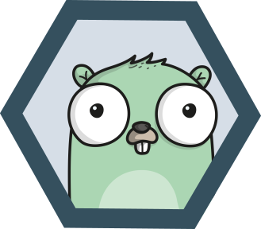

# HexaGo - Hexagonal Architecture Scaffolding CLI



[](https://pkg.go.dev/github.com/padiazg/hexago)
[](https://goreportcard.com/report/github.com/padiazg/hexago)
[](LICENSE)
[](https://github.com/padiazg/hexago/actions/workflows/quality.yml)

HexaGo is an opinionated CLI tool to scaffold for Go applications following the **Hexagonal Architecture** (Ports & Adapters) pattern. It helps developers maintain proper separation of concerns and build maintainable applications.

## Features

### Project Generation

- **One Command Setup** - Create complete projects instantly
- **Framework Support** - Echo, Gin, Chi, Fiber, or stdlib
- **Docker Ready** - Multi-stage Dockerfile + docker-compose
- **Graceful Shutdown** - Context-based with signal handling
- **Configuration** - Viper with YAML + environment variables
- **Observability** - Health checks and Prometheus metrics on the main server (no separate port)
- **Handler Plugin Pattern** - Self-contained route packages registered via `Use(ServerHandler)`
- **Testing** - go-testgen auto-generation for adapter code

### Component Generation

- **Services** - Add business logic services/usecases
- **Domain Entities** - Generate entities and value objects
- **Adapters** - HTTP handlers, repositories, external services
- **Auto-detection** - Respects existing project conventions
- **Smart Templates** - Context-aware code generation

### High Value Features

- **Workers** - Queue, periodic, and event-driven background workers
- **Migrations** - Database migrations with sequential numbering
- **Validation** - Architecture compliance validation

### Template Customization

- **Customizable Templates** - Modify generated code to match your style
- **Company Branding** - Add custom headers and comments
- **Team Sharing** - Version control and share custom templates
- **Multi-Source Loading** - Project-local, user-global, or embedded templates

### AI Assistant Integration

- **Built-in MCP Server** - `hexago mcp` starts a stdio Model Context Protocol server
- **9 MCP Tools** - Scaffold any component without leaving your AI chat
- **`--working-directory` flag** - Target any project from any directory, no `cd` required
- **`--in-place` init** - Generate into the current directory, no subfolder created
- **Multi-client support** - Claude Code, Claude Desktop, VS Code, Cursor, Windsurf, Zed

## Installation

Using Go

```shell
go install github.com/padiazg/hexago@latest
```

Using Homebrew

```shell
brew tap padiazg/hexago 
brew install hexago
```

Or build from source:

```shell
git clone https://github.com/padiazg/hexago.git
cd hexago
go build -o hexago
```

## Quick Start

### 1. Create a New Project

```shell
# Basic HTTP server with stdlib (in current directory)
hexago init my-app --module github.com/user/my-app

# With Echo framework
hexago init api-server --module github.com/user/api-server --framework echo

# Long-running service (no HTTP framework)
hexago init my-service --module github.com/company/my-service \
  --project-type service \
  --with-workers

# With alternative naming (DDD style)
hexago init ordering --module github.com/company/ordering \
  --adapter-style driver-driven \
  --core-logic usecases

# Target a specific parent directory (no cd required)
hexago init my-app --module github.com/user/my-app \
  --working-directory /home/user/projects

# Generate directly into the current directory (no <name> subfolder)
hexago init my-app --module github.com/user/my-app --in-place
```

### 2. Add Components

```shell
cd my-app

# Add domain entities
hexago add domain entity User --fields "id:string,name:string,email:string"
hexago add domain entity Product --fields "id:string,name:string,price:float64"

# Add business logic
hexago add service CreateUser --description "Creates a new user"
hexago add service GetUser

# Add repositories
hexago add adapter secondary database UserRepository
hexago add adapter secondary database ProductRepository

# Add HTTP handlers
hexago add adapter primary http UserHandler
hexago add adapter primary http ProductHandler

# All commands also accept --working-directory to avoid cd
hexago add service CreateUser --working-directory /home/user/projects/my-app
```

### 3. Run Your Application

```shell
# Build
go build

# Run
./my-app run

# Or use make
make run
```

Visit http://localhost:8080/health to see it working!

## Project Structure

Generated projects follow strict hexagonal architecture:

```
my-app/
├── cmd/                    # Cobra commands
│   ├── root.go            # Root command + config
│   └── run.go             # Framework-agnostic server + graceful shutdown
├── internal/
│   ├── core/              # 🎯 CORE - No external dependencies
│   │   ├── domain/        # Domain entities
│   │   └── services/      # Business logic (or usecases/)
│   ├── adapters/          # 🔌 ADAPTERS - External interfaces
│   │   ├── primary/       # Inbound (or driver/)
│   │   │   └── http/
│   │   │       ├── http.go      # Wires server + registers all route handlers
│   │   │       ├── ping/        # GET /ping handler
│   │   │       ├── health/      # /health endpoints (with --with-observability)
│   │   │       └── metrics/     # /metrics endpoint (with --with-observability)
│   │   └── secondary/     # Outbound (or driven/)
│   │       └── database/
│   ├── config/            # Configuration
│   └── observability/     # Health checker + Prometheus metrics helpers
├── pkg/                   # Reusable packages
│   ├── server/            # Server + ServerHandler interfaces
│   ├── httpserver/        # Framework-specific server with exported router + Use()
│   └── logger/
├── main.go                # Minimal entry point
├── .hexago.yaml           # HexaGo project config (init-time settings)
├── Makefile               # Common tasks
├── Dockerfile             # Multi-stage build
├── compose.yaml           # Docker Compose
└── README.md              # Architecture docs
```

## Commands

See the full [Commands Reference](https://padiazg.github.io/hexago/commands/) for all flags, examples, and usage:

| Command | Description |
| - | - |
| `hexago init` | Create a new hexagonal architecture project |
| `hexago add service` | Add a business logic service/use case |
| `hexago add domain` | Add a domain entity or value object |
| `hexago add adapter` | Add a primary or secondary adapter |
| `hexago add worker` | Add a background worker |
| `hexago add migration` | Add a database migration |
| `hexago add tool` | Add an infrastructure tool |
| `hexago validate` | Validate architecture compliance |
| `hexago mcp` | Start the MCP server for AI assistants |
| `hexago templates` | Manage and customize code generation templates |

## Examples

See the [URL Shortener full example](https://padiazg.github.io/hexago/examples/url-shortener-full-example/) for a complete walkthrough.

## Architecture Principles

### Dependency Rule

**Dependencies flow inward:**

```
Adapters → Services/UseCases → Domain
```

- **Core** never depends on adapters or infrastructure
- **Services** orchestrate domain logic and define ports
- **Adapters** implement the interfaces defined by core

### Layers

1. **Domain** (`internal/core/domain/`)
   - Pure business entities and value objects
   - Business logic and validation
   - Zero external dependencies

2. **Services/UseCases** (`internal/core/services/` or `usecases/`)
   - Application business logic
   - Orchestrates domain objects
   - Defines port interfaces
   - Framework-agnostic

3. **Adapters** (`internal/adapters/`)
   - **Primary/Driver**: Inbound (HTTP, gRPC, CLI, queues)
   - **Secondary/Driven**: Outbound (database, external APIs, cache)

4. **Infrastructure** (`internal/config/`, `pkg/`)
   - Configuration management
   - Logging
   - Cross-cutting concerns

## Configuration

Create `.my-app.yaml`:

```yaml
server:
  port: 8080
  readtimeout: 15s
  writetimeout: 15s
  shutdowntimeout: 30s

loglevel: info
logformat: json
```

Or use environment variables:

```shell
export MY_APP_SERVER_PORT=8080
export MY_APP_LOGLEVEL=debug
```

## Build & Run

See the [Build & Run guide](https://padiazg.github.io/hexago/development-guide/build-and-run/) for Makefile targets, Docker, and migration commands.

## `.hexago.yaml` — Project Configuration File

Every project generated by `hexago init` contains a `.hexago.yaml` file at its root:

```yaml
# .hexago.yaml - HexaGo project configuration
# Created by `hexago init`. Edit with care.

project:
  name: my-app
  module: github.com/user/my-app
  type: http-server       # http-server | service
  framework: echo         # echo | gin | chi | fiber | stdlib
  go_version: "1.21"
  author: ""

structure:
  adapter_style: primary-secondary  # primary-secondary | driver-driven
  core_logic: services              # services | usecases
  explicit_ports: false

features:
  with_docker: true
  with_observability: false
  with_migrations: false
  with_workers: false
  with_metrics: false
  with_example: false
```

**Two things this file enables:**

1. **Reliable `add *` commands** — settings like `framework` and `project_type` cannot be inferred from the directory structure alone. `.hexago.yaml` gives every `hexago add` command the full original config without guessing.

2. **Personal / team defaults for `hexago init`** — place a `.hexago.yaml` in any directory and run `hexago init` from there. Any flag you omit will be filled from the file. Explicitly supplied flags always win. Priority: `flags > .hexago.yaml > hardcoded defaults`.

   ```shell
   # ~/.config/hexago/.hexago.yaml sets framework: echo, with_docker: true, etc.
   # Only the project name is required on the command line:
   cd ~/projects
   hexago init new-service --module github.com/me/new-service
   ```

## Framework Support

HexaGo generates framework-specific code:

- **stdlib** - Standard library `http.Handler`
- **Echo** - `func(echo.Context) error`
- **Gin** - `func(*gin.Context)`
- **Chi** - Standard library with chi router
- **Fiber** - `func(*fiber.Ctx) error`

## Naming Flexibility

HexaGo supports different naming conventions:

**Adapter Naming:**

- `primary-secondary` (DDD terminology)
- `driver-driven` (Ports & Adapters terminology)

**Core Logic:**

- `services` (DDD terminology)
- `usecases` (Use case driven design)

Choose what fits your team's vocabulary!

## Documentation

- [Installation](https://padiazg.github.io/hexago/getting-started/installation/)
- [Quick Start](https://padiazg.github.io/hexago/getting-started/quickstart/)
- [Commands Reference](https://padiazg.github.io/hexago/commands/)
- [Architecture Overview](https://padiazg.github.io/hexago/architecture/overview/)
- [Project Structure](https://padiazg.github.io/hexago/architecture/project-structure/)
- [Template Customization](https://padiazg.github.io/hexago/customization/templates/)
- [Development Guide](https://padiazg.github.io/hexago/development-guide/)
- [Examples](https://padiazg.github.io/hexago/examples/url-shortener-full-example/)
- [Changelog](https://padiazg.github.io/hexago/changelog/)

## Troubleshooting

See the [Development Guide](https://padiazg.github.io/hexago/development-guide/) for common issues and solutions.

## Contributing

Contributions welcome! Please:

1. Fork the repository
2. Create a feature branch
3. Make your changes
4. Add tests
5. Submit a pull request

## License

MIT License - see [LICENSE](LICENSE) file

## Learn More

- [Hexagonal Architecture](https://alistair.cockburn.us/hexagonal-architecture/)
- [Clean Architecture](https://blog.cleancoder.com/uncle-bob/2012/08/13/the-clean-architecture.html)
- [Ports & Adapters](https://herbertograca.com/2017/11/16/explicit-architecture-01-ddd-hexagonal-onion-clean-cqrs-how-i-put-it-all-together/)

---

## MCP Server

HexaGo includes a built-in [MCP](https://modelcontextprotocol.io/) server so AI
assistants can scaffold hexagonal architecture projects without leaving their conversation.

### Available tools

| Tool | What it does |
| - | - |
| `hexago_init` | Initialize a new project |
| `hexago_add_service` | Add a business logic service |
| `hexago_add_domain_entity` | Add a domain entity |
| `hexago_add_domain_valueobject` | Add a domain value object |
| `hexago_add_adapter` | Add a primary or secondary adapter |
| `hexago_add_worker` | Add a background worker |
| `hexago_add_migration` | Add a database migration |
| `hexago_add_tool` | Add an infrastructure tool |
| `hexago_validate` | Validate architecture compliance |

All tools accept a required `working_directory` parameter. `hexago_init` also accepts `in_place: true` to generate files directly into `working_directory`.

See the [MCP Server docs](https://padiazg.github.io/hexago/commands/mcp/) for per-client configuration (Claude Code, Claude Desktop, VS Code, Cursor, Windsurf, Zed).

### Quick reference

| Client | Config file | Key | `type` field |
| - | - | - | - |
| Claude Code | `~/.claude.json` / `.mcp.json` | `mcpServers` | — |
| Claude Desktop | `claude_desktop_config.json` | `mcpServers` | — |
| VS Code | `.vscode/mcp.json` or `…/Code/User/mcp.json` | `servers` | `"stdio"` required |
| Cursor | `.cursor/mcp.json` or `~/.cursor/mcp.json` | `mcpServers` | — |
| Windsurf | `mcp_config.json` | `mcpServers` | — |
| Zed | `settings.json` | `context_servers` | `source: "custom"` |

---

Built with ❤️ for clean architecture enthusiasts
